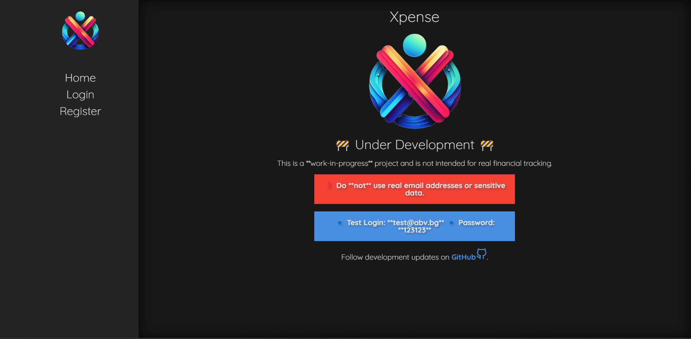
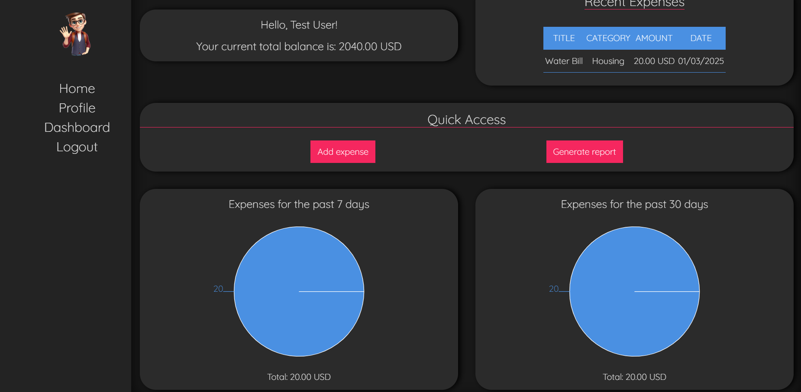
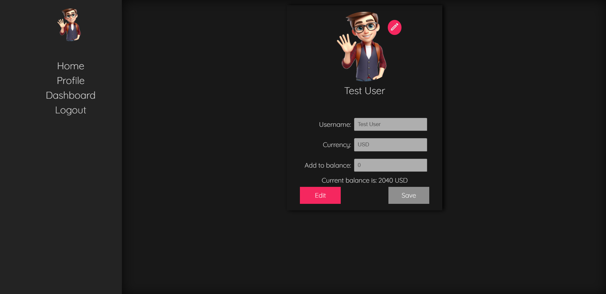

# Xpense - Expense Tracker App

Xpense is a full-stack expense tracking application designed to help users manage their finances efficiently. This project is part of my junior developer portfolio, demonstrating my ability to develop a complete web application from frontend to backend.

## 🚀 Features

- **User Authentication** (JWT-based login/signup)
- **Expense Management** (Add, update, delete, and categorize expenses)
- **Budget Tracking** (Set monthly budgets and monitor spending)
- **Profile Management** (Update user information and upload profile picture)
- **Balance Management** (Add money to your balance)
- **Dashboard Overview** (Displays total balance, most recent 5 expenses, and two pie chart reports for the past 7 and 30 days)
- **Interactive Charts** 📊 (Visualize expenses with pie charts for the past 7 and 30 days)
- **Dark Mode Support** 🌙
- **Fully Responsive Design** 📱💻

## 🛠 Tech Stack

### Frontend

- React ⚛️ + TypeScript
- React Query (for efficient data fetching)
- Styled Components (for modular styling)
- Framer Motion (for animations)
- Recharts (for interactive charts)
- React Router DOM (for routing)
- Redux Toolkit (for state management)
- React-Redux (to integrate Redux with React)

### Backend

- Node.js + Express.js
- TypeScript
- MongoDB + Mongoose (for database)
- JWT Authentication

## 🚀 Live Demo

The application is deployed and accessible online. No installation is required.

🔗 [Live Demo](https://xpense-blue.vercel.app/)

## 🎨 UI Preview

## 📌 Future Enhancements

- ✅ Update and delete expenses
- ✅ Light theme
- ✅ Generate reports with multiple filter options

## 📝 License

This project is for **academic purposes only** and is not intended for production use.

## 📬 Contact

For questions or collaboration, feel free to reach out:

- **Email**: n.nikolov.business@outlook.com
- **LinkedIn**: [Nikola Nikolov](www.linkedin.com/in/nikola-nikolov-a53b2925a)
- **GitHub**: [NikolaNikolov93](https://github.com/NikolaNikolov93)

---

Made with ❤️ by Nikola Nikolov 🚀
